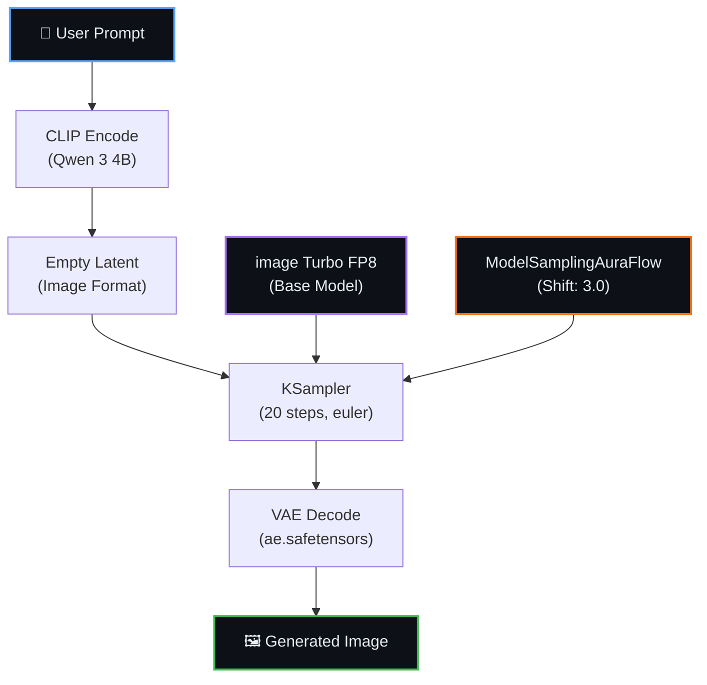
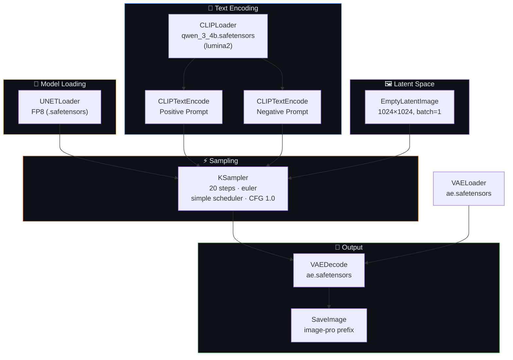
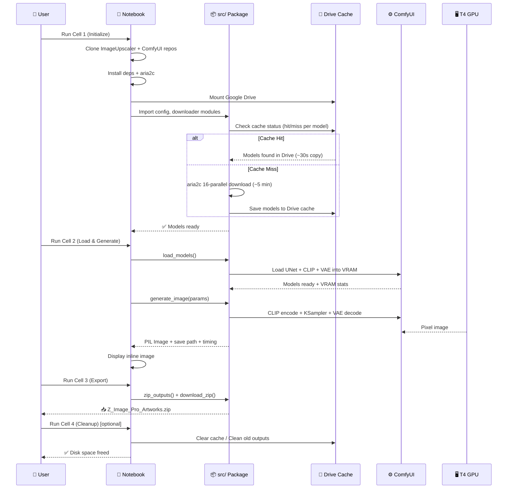
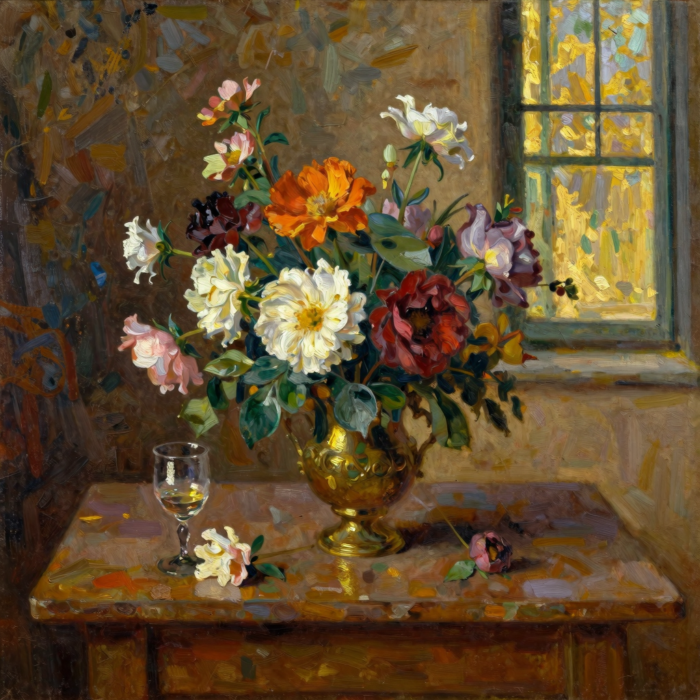
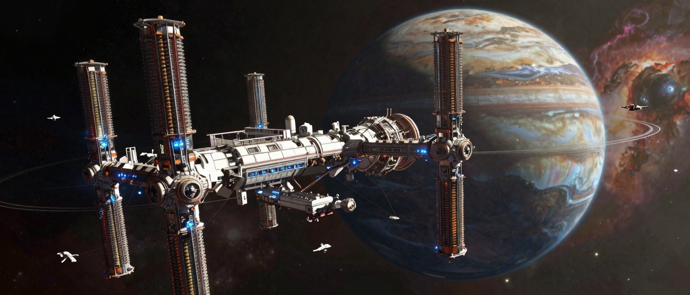

<div align="center">


<br/>

[](https://colab.research.google.com/github/festverse/Image-Upscaler/blob/main/notebook/ImageUpscaler.ipynb)
[](GUIDE.md)

<br/>

[](https://github.com/festverse/Image-Upscaler/stargazers)
[](https://github.com/festverse/Image-Upscaler/network/members)
[](https://github.com/festverse/Image-Upscaler/issues)
[](https://github.com/festverse/Image-Upscaler/pulls)
[](https://github.com/festverse/Image-Upscaler/commits/main)
[](https://github.com/festverse/Image-Upscaler)

<br/>

[](https://huggingface.co/T5B/image-Turbo-FP8)
[](https://github.com/comfyanonymous/ComfyUI)
[](https://colab.research.google.com)
[](https://www.python.org/)
[](LICENSE)

<br/>

**No setup. No install. No GPU? No problem.**

Open notebook in Google Colab, set runtime to T4, and run — it's that simple.

**Tags:** `fp8` `comfyui` `diffusion` `image-generation` `colab-notebook` `text-to-image` `model-quantization` `huggingface` `python`

</div>

---

## 📑 Table of Contents

<details open>
<summary><b>Quick Navigation</b></summary>

<br/>

| Section | Description |
|:--------|:------------|
| [📖 Overview](#-overview) | What is image Turbo Pro? |
| [📂 Project Structure](#-project-structure) | Repository layout |
| [🧩 Architecture](#-architecture) | Pipeline flow diagram |
| [⚙️ Pipeline Components](#️-pipeline-components) | Models and tools used |
| [🚀 Quick Start](#-quick-start) | Get running in 3 steps |
| [🎛️ Generation Parameters](#️-generation-parameters) | All configurable options |
| [📊 Samplers & Schedulers](#-samplers--schedulers) | Denoising algorithms explained |
| [📐 Supported Resolutions](#-supported-resolutions) | Aspect ratios and sizes |
| [💡 How It Works](#-how-it-works) | Step-by-step sequence |
| [🧠 Model Details](#-model-details) | Technical specs of each component |
| [🔋 Resource Requirements](#-resource-requirements) | GPU, RAM, disk specs |
| [🐍 Python Modules](#-python-modules) | Modular source code reference |
| [🖼️ Preview](#️-preview) | Example prompts and output previews |
| [🧪 Tips & Tricks](#-tips--tricks) | Get the best results |
| [❓ FAQ](#-faq) | Common questions answered |
| [🐛 Troubleshooting](#-troubleshooting) | Fix common issues |
| [🙏 Acknowledgements](#-acknowledgements) | Credits and references |
| [🤝 Contributing](#-contributing) | How to contribute |
| [📜 License](#-license) | MIT license details |
| [⭐ Star History](#-star-history) | Community growth chart |

</details>

---

## 📖 Overview

image Turbo Pro is a **next-gen FP8 diffusion pipeline** with ComfyUI backend and smart caching. Professional-grade image generation on free Colab hardware — zero setup, zero configuration.

> [!NOTE]
> **Why FP8?** FP8 (8-bit floating point) quantization cuts VRAM usage nearly in half compared to full precision while preserving output quality. This enables pro-grade image generation on free T4 GPUs — no paid Colab tier required.

> [!WARNING]
> **Content Safety Notice**: image is an unfiltered diffusion model. It does not have built-in NSFW filters. Users are solely responsible for the content they generate. Do not use this tool to create illegal, harmful, or non-consensual content. By using this project, you agree to comply with all applicable laws and the [HuggingFace content policy](https://huggingface.co/content-guidelines). The authors assume no liability for misuse.

### ✨ Key Features

| Feature | Description |
|---------|-------------|
| ⚡ **FP8 Optimized** | Half the VRAM, full quality — runs on free T4 Colab |
| 💾 **Smart Cache** | Models cached in Google Drive — instant on restart |
| 🎯 **One-Click** | Zero configuration — just open and run |
| 🔋 **GPU Ready** | Free Google Colab T4 is sufficient |
| ⚙️ **ComfyUI Backend** | Node-based pipeline engine — battle-tested and extensible |
| 🌐 **aria2c Downloader** | 16-connection parallel downloads for fast model fetching |
| 🧹 **Auto-Cleanup** | Clear old outputs and Drive cache to free disk space |
| 🔧 **Modular Source** | Clean `src/` package — easy to extend and maintain |

### 📦 What's Included

| Component | File | Purpose |
|-----------|------|---------|
| **Notebook** | `notebook/ImageUpscaler.ipynb` | 4-cell Colab notebook — the main entry point |
| **Config** | `src/config.py` | Constants, defaults, model URLs, resolution presets |
| **Downloader** | `src/downloader.py` | aria2c/GDrive/Civitai asset fetcher |
| **Generator** | `src/generator.py` | In-process ComfyUI node loading + image generation |
| **Exporter** | `src/exporter.py` | Zip and download generated images |
| **Guide** | `GUIDE.md` | Comprehensive beginner-friendly user guide |
| **Prompts** | `PROMPT.md` | 8 ready-to-use example prompts with settings |
| **Contributing** | `CONTRIBUTING.md` | How to contribute (bugs, features, code) |
| **License** | `LICENSE` | MIT license text |
| **Changelog** | `CHANGELOG.md` | Version history with dates and descriptions |

---

## 📂 Project Structure

```
ImageUpscaler/
├── CHANGELOG.md              # Version history (newest first)
├── CONTRIBUTING.md           # How to contribute (bugs, features, code)
├── GUIDE.md                  # Comprehensive beginner-friendly user guide
├── LICENSE                   # MIT
├── PROMPT.md                 # 8 example prompts with settings
├── README.md                 # This file
├── SECURITY.md               # Vulnerability reporting policy
├── .gitignore                # Python, Jupyter, model files, OS artifacts
├── requirements.txt          # Python dependencies
│
├── .github/
│   ├── ISSUE_TEMPLATE/
│   │   ├── bug_report.md     # Bug report template
│   │   └── feature_request.md # Feature request template
│   └── PULL_REQUEST_TEMPLATE.md # PR checklist
│
├── notebook/
│   └── ImageUpscaler.ipynb       # Main Colab notebook (4 code cells + 3 markdown)
│
└── src/
    ├── __init__.py            # Package marker + shared UI logger + run_quiet helper
    ├── config.py              # All constants and default parameters
    ├── downloader.py          # Asset download engine (aria2c, GDrive, Civitai)
    ├── generator.py           # In-process ComfyUI node loader + image generator
    └── exporter.py            # Output zip + Colab download helper
```

---

## 🧩 Architecture

### High-Level Pipeline



### ComfyUI Node Graph



---

## ⚙️ Pipeline Components

| Component | Model / Config | Type | Size | Purpose |
|-----------|---------------|------|------|---------|
| **Base Model** | image Turbo FP8 | UNet | ~4 GB | FP8 quantized diffusion backbone — generates latents |
| **Text Encoder** | `qwen_3_4b.safetensors` | CLIP | ~2.5 GB | Encodes text prompts into conditioning vectors |
| **VAE Decoder** | `ae.safetensors` | VAE | ~300 MB | Decodes latent tensors into pixel-space images |
| **AuraFlow Sampler** | `ModelSamplingAuraFlow` | Node | — | Applies shift parameter to the sampling schedule |
| **KSampler** | `euler` | Node | — | Iterative denoising — runs the actual generation |

---

## 🚀 Quick Start

<div align="center">

[](https://colab.research.google.com/github/festverse/Image-Upscaler/blob/main/notebook/ImageUpscaler.ipynb)

</div>

| Step | Cell | What Happens | Duration |
|:----:|------|-------------|----------|
| 🛠️ | **1. Initialize** | Clone ImageUpscaler repo, clone ComfyUI, install Python deps, install aria2c, mount Drive, check cache, download models | ~3–5 min (first) / ~30s (cached) |
| 🚀 | **2. Load & Generate** | Load FP8 weights into VRAM, configure prompt & settings, generate image | ~30 sec |
| 💾 | **3. Export** | Zip all output PNGs and trigger browser download | ~5 sec |
| 🧹 | **4. Cache & Cleanup** | Clear Drive cache, clean old outputs, free disk space | ~5 sec |

### 📓 Kaggle Notebook

Prefer Kaggle? Import the notebook:

1. Go to [kaggle.com/code](https://www.kaggle.com/code) → **New Notebook**
2. **File** → **Import Notebook** → paste this URL:

```
https://raw.githubusercontent.com/festverse/Image-Upscaler/main/notebook/ImageUpscaler-Kaggle.ipynb
```

3. Sidebar ⚙️ → **Accelerator** → **GPU T4 x2**
4. Sidebar ⚙️ → **Internet** → **On**
5. Run all cells — same workflow, same results

> 💡 **Tip**: Kaggle gives 30 hours/week of free GPU. Great alternative when Colab quota is exhausted.

### Detailed Cell Breakdown

**Cell 1 — Initialize**
```python
# Clones the ImageUpscaler repo (provides src/ modules)
# Clones ComfyUI (the pipeline engine)
# Installs: xformers, torch, comfyui deps
# Installs aria2c system package
# Mounts Google Drive for persistent model cache
# Checks cache status (hit/miss per model with sizes)
# Downloads: UNet FP8 model, text encoder, VAE (via aria2c 16-parallel)
# Saves to Drive cache after first download
```

**Cell 2 — Load & Generate**
```python
# Loads UNet, CLIP, VAE models into VRAM via src.generator.load_models()
# Reports VRAM usage (allocated / total)
# Encodes positive/negative prompts via CLIP
# Creates empty latent, runs KSampler denoising
# Decodes through VAE, saves PNG to /content/results
# Displays image inline with generation timing
```

**Cell 3 — Export**
```python
# Shows output count and total size
# Zips all .png files from /content/results
# Triggers browser download via google.colab.files API
```

**Cell 4 — Cache & Cleanup**
```python
# Shows disk space, output stats, Drive cache status
# Optional: Clear Drive cache (reclaim ~7 GB)
# Optional: Clean old outputs (with keep-latest option)
```

---

## 🎛️ Generation Parameters

### Prompt Settings

| Parameter | Type | Default | Description |
|-----------|------|---------|-------------|
| `positive_prompt` | String | `""` | Positive prompt — describe what you want to see |
| `negative_prompt` | String | `"blurry, low quality, text, watermark, distorted"` | Negative prompt — what to avoid |

### Image Dimensions

| Parameter | Type | Default | Range | Description |
|-----------|------|---------|-------|-------------|
| `width` | Int | `1024` | 512–2048 (step 64) | Output width in pixels |
| `height` | Int | `1024` | 512–2048 (step 64) | Output height in pixels |

### Sampler Settings

| Parameter | Type | Default | Range | Description |
|-----------|------|---------|-------|-------------|
| `steps` | Int | `20` | 10–50 | Denoising iterations — more steps = more detail but slower |
| `cfg` | Float | `1.0` | 1.0–10.0 | Classifier-Free Guidance scale — how closely to follow the prompt |
| `sampler_name` | String | `"euler"` | See list below | Denoising algorithm |
| `scheduler` | String | `"simple"` | See list below | Noise schedule type |
| `seed` | Int | `-1` | -1–∞ | RNG seed. `-1` = random each time. Same seed = reproducible output |

---

## 📊 Samplers & Schedulers

### Available Samplers

| Sampler | Speed | Quality | Best For |
|---------|:-----:|:-------:|----------|
| `euler` | ⚡⚡⚡ | ⭐⭐⭐⭐ | **Default** — fast, clean results |
| `euler_ancestral` | ⚡⚡⚡ | ⭐⭐⭐⭐ | More variation, slightly noisy |
| `res_multistep` | ⚡⚡⚡ | ⭐⭐⭐⭐⭐ | Best overall for image |
| `dpmpp_2m` | ⚡⚡ | ⭐⭐⭐⭐⭐ | High quality, slower |
| `dpmpp_2m_sde` | ⚡⚡ | ⭐⭐⭐⭐⭐ | Excellent detail |
| `dpmpp_3m_sde` | ⚡ | ⭐⭐⭐⭐⭐ | Best quality, slowest |
| `lcm` | ⚡⚡⚡⚡ | ⭐⭐⭐ | Ultra-fast, lower quality |
| `ddim` | ⚡⚡⚡ | ⭐⭐⭐ | Deterministic, predictable |
| `uni_pc` | ⚡⚡ | ⭐⭐⭐⭐ | Good balance |

### Available Schedulers

| Scheduler | Description |
|-----------|-------------|
| `simple` | **Default** — simple linear interpolation |
| `beta` | Beta distribution schedule — excellent for image |
| `normal` | Standard linear schedule |
| `karras` | Karras noise schedule — popular for SD models |
| `exponential` | Exponential decay schedule |
| `sgm_uniform` | Uniform schedule from SGM |
| `ddim_uniform` | DDIM-style uniform schedule |

---

## 📐 Supported Resolutions

| Aspect Ratio | Resolution | Megapixels | Best For |
|:------------:|:----------:|:----------:|----------|
| **1:1** | 1024 × 1024 | 1.05 MP | Avatars, social media posts, profile pictures |
| **16:9** | 1280 × 720 | 0.92 MP | YouTube thumbnails, desktop wallpapers, presentations |
| **9:16** | 720 × 1280 | 0.92 MP | Mobile wallpapers, Instagram/TikTok stories |
| **4:3** | 1152 × 864 | 1.00 MP | Classic photography, print layouts |
| **21:9** | 1344 × 576 | 0.77 MP | Ultrawide monitors, cinematic compositions |

> 💡 **Custom resolutions**: The notebook supports any resolution from 512×512 to 2048×2048 (step 64). Use the slider inputs or type directly.

---

## 💡 How It Works



---

## 🧠 Model Details

### image Turbo FP8

| Property | Value |
|----------|-------|
| **Architecture** | Diffusion Transformer (DiT) |
| **Quantization** | FP8 (8-bit floating point) |
| **Resolution** | Trained at 1024×1024 |
| **Backbone** | image Turbo |
| **HuggingFace** | [T5B/image-Turbo-FP8](https://huggingface.co/T5B/image-Turbo-FP8) |

### Qwen 3 4B Text Encoder

| Property | Value |
|----------|-------|
| **Architecture** | Qwen 3 (4B parameters) |
| **Purpose** | Text → conditioning vectors for CLIP guidance |
| **Format** | `qwen_3_4b.safetensors` |
| **Loader** | CLIPLoader with `lumina2` type |

### VAE Decoder

| Property | Value |
|----------|-------|
| **File** | `ae.safetensors` |
| **Purpose** | Decode latent space tensors → RGB pixel images |
| **Latent Format** | Standard (EmptyLatentImage) |

---

## 🔋 Resource Requirements

| Resource | Minimum | Recommended | Notes |
|----------|---------|-------------|-------|
| **GPU** | T4 (16 GB VRAM) | T4 or better | Free on Google Colab |
| **System RAM** | 12 GB | 16 GB | ComfyUI + model loading |
| **Disk Space** | ~8 GB (base) | 15 GB | Base models + outputs |
| **Python** | 3.10+ | Colab default | Required for torch/ComfyUI |
| **Internet** | Required | Stable connection | For model downloads (first run only) |

### Disk Breakdown

| Component | Size | Cached? |
|-----------|------|---------|
| ComfyUI + deps | ~2 GB | Yes (Colab session) |
| image FP8 UNet | ~4 GB | Yes |
| Qwen 3 4B Encoder | ~2.5 GB | Yes |
| VAE | ~300 MB | Yes |
| Output (per image) | ~2–5 MB | No |

> 💡 **First run** takes ~5–8 minutes for downloads. Models are automatically cached to Google Drive — subsequent sessions skip the download entirely (~30s copy from Drive).

---

## 🐍 Python Modules

The `src/` package contains the modular pipeline code. Each module has a specific responsibility:

### `src/config.py`
All constants and defaults in one place.

```python
from src.config import WORKSPACE, MODEL_DIRS, DEFAULTS, RESOLUTIONS, SAMPLERS, SCHEDULERS

# Example: get default generation params
print(DEFAULTS["steps"])       # 20
print(RESOLUTIONS["16:9"])     # (1280, 720)
```

### `src/downloader.py`
Asset fetching with aria2c acceleration and Google Drive caching.

```python
from src.downloader import ensure_aria2, mount_drive, download_file, get_cache_status, clear_cache

ensure_aria2()                                    # Install aria2c
mount_drive()                                     # Mount Drive for cache
download_file("https://...", "/content/models")   # Cache-first download
status = get_cache_status([url1, url2])           # Check what's cached
clear_cache()                                     # Reclaim ~7 GB
```

### `src/generator.py`
In-process ComfyUI node loading and image generation.

```python
from src.generator import load_models, generate_image

nodes, unet, clip, vae = load_models()
img, path = generate_image(nodes, unet, clip, vae, prompt="a cat")
```

### `src/exporter.py`
Output packaging, stats, and cleanup.

```python
from src.exporter import zip_outputs, download_zip, cleanup_outputs, get_output_stats

stats = get_output_stats()    # Count + size of outputs
zip_path = zip_outputs()      # Zip all PNGs
if zip_path:
    download_zip(zip_path)    # Browser download
cleanup_outputs(keep_latest=5)  # Keep last 5, delete rest
```

---

## 🖼️ Preview

<table>
<tr>
<td width="50%" valign="top">

### 🌆 Cyberpunk City


</td>
<td width="50%" valign="top">

### 🧝‍♀️ Fantasy Portrait


</td>
</tr>
</table>

<table>
<tr>
<td width="50%" valign="top">

### 🏔️ Landscape


</td>
<td width="50%" valign="top">

### 🎌 Anime Style


</td>
</tr>
</table>

<table>
<tr>
<td width="50%" valign="top">

### 🐉 Fantasy Creature


</td>
<td width="50%" valign="top">

### 🖼️ Oil Painting


</td>
</tr>
</table>

<table>
<tr>
<td width="50%" valign="top">

### 🚀 Sci-Fi Concept


</td>
<td width="50%" valign="top">

### 🐱 Cute & Cozy


</td>
</tr>
</table>

<div align="center">

> *Run these prompts in the notebook to generate your own showcase images!*

</div>

### 🎨 Example Prompts

<table>
<tr>
<td width="50%">

#### 🌆 Cyberpunk City
```
PROMPT: "a breathtaking cyberpunk cityscape at 
night, neon lights reflecting on wet streets, 
massive holographic billboards, flying cars, 
rain particles, volumetric fog, cinematic 
lighting, ultra detailed, 8k"

NEGATIVE: "blurry, low quality, text, 
watermark, distorted"

SETTINGS: 1024×1024 · Steps: 20 · CFG: 1.0
SAMPLER: euler · SCHEDULER: simple
SEED: 42
```

</td>
<td width="50%">

#### 🧝 Fantasy Portrait
```
PROMPT: "ethereal elven woman with flowing 
silver hair, intricate golden crown, emerald 
eyes, soft magical glow, forest background, 
bokeh, artstation style, masterpiece, 
best quality, highly detailed"

NEGATIVE: "blurry, low quality, text, 
watermark, distorted, extra fingers"

SETTINGS: 720×1280 (9:16) · Steps: 20 · CFG: 1.0
SAMPLER: euler · SCHEDULER: simple
SEED: 1337
```

</td>
</tr>
<tr>
<td width="50%">

#### 🏔️ Landscape
```
PROMPT: "majestic mountain range at golden hour, 
dramatic clouds, crystal clear lake reflection, 
pine forest, atmospheric perspective, 
national geographic style, photorealistic, 
8k uhd, sharp focus"

NEGATIVE: "blurry, low quality, text, 
watermark, distorted, oversaturated"

SETTINGS: 1280×720 (16:9) · Steps: 20 · CFG: 1.0
SAMPLER: euler · SCHEDULER: simple
SEED: 7777
```

</td>
<td width="50%">

#### 🎌 Anime Style
```
PROMPT: "anime girl sitting on a rooftop at 
sunset, cherry blossom petals falling, school 
uniform, wind blowing hair, warm golden 
lighting, studio ghibli style, beautiful 
detailed eyes, masterpiece"

NEGATIVE: "blurry, low quality, text, 
watermark, distorted, bad anatomy"

SETTINGS: 720×1280 (9:16) · Steps: 20 · CFG: 1.0
SAMPLER: euler · SCHEDULER: simple
SEED: 2024
```

</td>
</tr>
<tr>
<td width="50%">

#### 🐉 Fantasy Creature
```
PROMPT: "massive dragon perched on a cliff edge, 
glowing scales, smoke rising from nostrils, 
epic fantasy landscape, dramatic storm clouds, 
god rays, cinematic composition, concept art, 
highly detailed, 8k"

NEGATIVE: "blurry, low quality, text, 
watermark, distorted, cartoonish"

SETTINGS: 1344×576 (21:9) · Steps: 20 · CFG: 1.0
SAMPLER: euler · SCHEDULER: simple
SEED: 9999
```

</td>
<td width="50%">

#### 🖼️ Oil Painting
```
PROMPT: "still life oil painting of a table 
with fresh flowers, vintage wine glass, golden 
afternoon light through window, impressionist 
brushstrokes, renaissance style, museum quality, 
rich warm color palette, textured canvas"

NEGATIVE: "blurry, low quality, text, 
watermark, distorted, modern, digital art"

SETTINGS: 1024×1024 · Steps: 20 · CFG: 1.0
SAMPLER: euler · SCHEDULER: simple
SEED: 1888
```

</td>
</tr>
<tr>
<td width="50%">

#### 🚀 Sci-Fi Concept
```
PROMPT: "massive space station orbiting a gas 
giant, intricate mechanical details, glowing 
energy conduits, tiny spacecraft for scale, 
nebula background, hard sci-fi concept art, 
matte painting, cinematic, 8k ultra wide"

NEGATIVE: "blurry, low quality, text, 
watermark, distorted, cartoon"

SETTINGS: 1344×576 (21:9) · Steps: 20 · CFG: 1.0
SAMPLER: euler · SCHEDULER: simple
SEED: 3141
```

</td>
<td width="50%">

#### 🐱 Cute & Cozy
```
PROMPT: "fluffy orange cat sleeping on a stack 
of books, cozy rainy day, warm indoor lighting, 
soft blanket, steaming cup of tea, hygge 
atmosphere, watercolor illustration style, 
pastel colors, adorable, heartwarming"

NEGATIVE: "blurry, low quality, text, 
watermark, distorted, scary, dark"

SETTINGS: 1024×1024 · Steps: 20 · CFG: 1.0
SAMPLER: euler · SCHEDULER: simple
SEED: 5555
```

</td>
</tr>
</table>

> 💡 **Tip**: Use the same seed to reproduce exact results. Try different samplers (`res_multistep`, `dpmpp_2m`) for varied output styles.

---

## 🧪 Tips & Tricks

<table>
<tr>
<td width="50%" valign="top">

### 🖊️ Prompting
- **Be specific** — "a watercolor painting of a mountain at sunset" > "mountain"
- **Style words** — mention art style, lighting, camera angle
- **Negative prompts** — use to exclude unwanted artifacts
- **CLIP encoding** — Qwen 3 4B understands natural language well

</td>
<td width="50%" valign="top">

### 💾 Output & Performance
- **Smart cache** — models persist across runs in same session
- **Resolution** — stick to trained resolution (1024²) for best results
- **First run** — ~8 GB download, be patient
- **Seed = -1** — random each time. Set a specific seed for reproducibility

</td>
</tr>
</table>

<table>
<tr>
<td width="50%" valign="top">

### ⚡ Speed
- **Steps: 20** — good balance of quality and speed
- **CFG: 1.0** — low CFG works well with AuraFlow shift
- **Sampler** — `euler` is fast and clean for this model
- **T4 GPU** — free tier is sufficient for single images

</td>
<td width="50%" valign="top">

### 🎯 Quality
- **More steps** — increase to 30-50 for maximum detail
- **Alternative samplers** — try `res_multistep` or `dpmpp_2m_sde`
- **Alternative schedulers** — try `beta` for potentially better results
- **Resolution match** — use aspect ratios trained into the model

</td>
</tr>
</table>

---

## ❓ FAQ

<details>
<summary><b>Do I need a GPU to use this?</b></summary>

Not locally. The notebook runs on Google Colab's free T4 GPU. Just open the notebook and run.
</details>

<details>
<summary><b>Can I use this locally?</b></summary>

Yes, but you'll need a GPU with 16GB+ VRAM and Python 3.10+. Install ComfyUI, clone this repo, and run the `src/` modules directly.
</details>

<details>
<summary><b>Why FP8 instead of GGUF?</b></summary>

FP8 is faster and produces better quality. GGUF is used as a fallback in other pipelines when FP8 isn't supported. ImageUpscaler is optimized for FP8-first hardware.
</details>

<details>
<summary><b>Why 20 steps? Can I use fewer?</b></summary>

20 steps provides excellent quality with `euler` sampler. You can reduce to 10-15 for faster generation or increase to 30-50 for maximum detail. image Turbo converges quickly.
</details>

<details>
<summary><b>Can I use this commercially?</b></summary>

This project is licensed under **MIT**. You can use, modify, and distribute it freely. Check the individual model licenses for image.
</details>

---

## 🐛 Troubleshooting

| Problem | Cause | Solution |
|---------|-------|----------|
| `CUDA out of memory` | Resolution too high | Lower resolution or reduce batch size |
| `Module not found: comfyui` | ComfyUI not cloned properly | Re-run Cell 1 |
| `No images in output` | Generation not started | Wait for Cell 2's "✅ Engine Online" message |
| `Download failed` | Network timeout or invalid URL | Check URL, re-run Cell 1 |
| `Colab disconnects` | Idle timeout or session limit | Stay active, or upgrade to Colab Pro |
| `ImportError: gdown` | gdown not installed | Run `!pip install gdown` in a cell |
| `FP8 not loading` | GPU doesn't support FP8 | Try a different Colab runtime (T4/A100) |
| `Low disk space` | Too many outputs or cache | Run Cell 4 (🧹 Cache & Cleanup) |
| `Cache not working` | Drive not mounted | Check Cell 1 output for Drive mount status |
| `Slow first run` | Normal — downloads ~7 GB | Models cache to Drive; next run is ~30s |

---

## 🙏 Acknowledgements

<table>
<tr>
<td width="50%" valign="top">

### 🛠️ Tools
- [ComfyUI](https://github.com/comfyanonymous/ComfyUI) — Node-based diffusion backend
- [Google Colab](https://colab.research.google.com) — Free GPU runtime
- [aria2c](https://aria2.github.io) — Multi-connection download accelerator

</td>
<td width="50%" valign="top">

### 🧠 Models
- [image Turbo FP8](https://huggingface.co/T5B/image-Turbo-FP8) — Base diffusion model
- [Qwen 3 4B](https://huggingface.co/Comfy-Org/z_image_turbo) — Text encoder
- [Comfy-Org](https://huggingface.co/Comfy-Org) — Pre-converted model files

</td>
</tr>
</table>

---

## 🤝 Contributing

Contributions are welcome! Here's how you can help:

<table>
<tr>
<td width="33%" align="center">

### 🐛 Report Bugs
Found something broken?

[Open an Issue](https://github.com/festverse/Image-Upscaler/issues)

</td>
<td width="33%" align="center">

### 💡 Suggest Features
Have an idea for the notebook?

[Start a Discussion](https://github.com/festverse/Image-Upscaler/issues)

</td>
<td width="33%" align="center">

### 🔀 Submit PRs
Ready to contribute code?

[Fork & Submit](https://github.com/festverse/Image-Upscaler/fork)

</td>
</tr>
</table>

### Development Setup

```bash
# Clone the repo
git clone https://github.com/festverse/Image-Upscaler.git
cd ImageUpscaler

# Install dependencies
pip install -r requirements.txt

# Import modules
from src.config import DEFAULTS
from src.downloader import ensure_aria2
from src.generator import load_models, generate_image
from src.exporter import zip_outputs
```

---

## 📜 License

<div align="center">

[](LICENSE)

This project is licensed under the **MIT License**.

Free to use, modify, and distribute — see the [LICENSE](LICENSE) file for details.

</div>

---

## ⭐ Star History

<div align="center">

[](https://star-history.com/#festverse/Image-Upscaler&Date)

</div>

---

## 💕 Loved My Work?
🚨 [Follow me on GitHub](https://github.com/festverse)

⭐ [Give a star to this project](https://github.com/festverse/Image-Upscaler)

<div align="center">
  
<a href="https://github.com/festverse/Image-Upscaler">

</a>

<i>~ For inquiries or collaborations</i>
     
[](https://telegram.me/festverse "Contact on Telegram")
[](https://instagram.com/ikx7.a "Follow on Instagram")
[](mailto:ikx7a@hotmail.com "Send an Email")

<sup><b>Copyright © <a href="https://telegram.me/festverse">Utsav Vasava</a> All Rights Reserved</b></sup>

</div>
